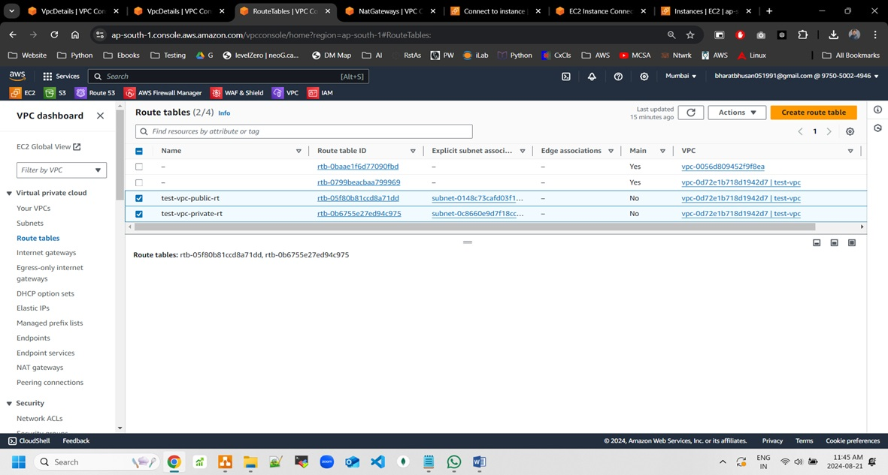
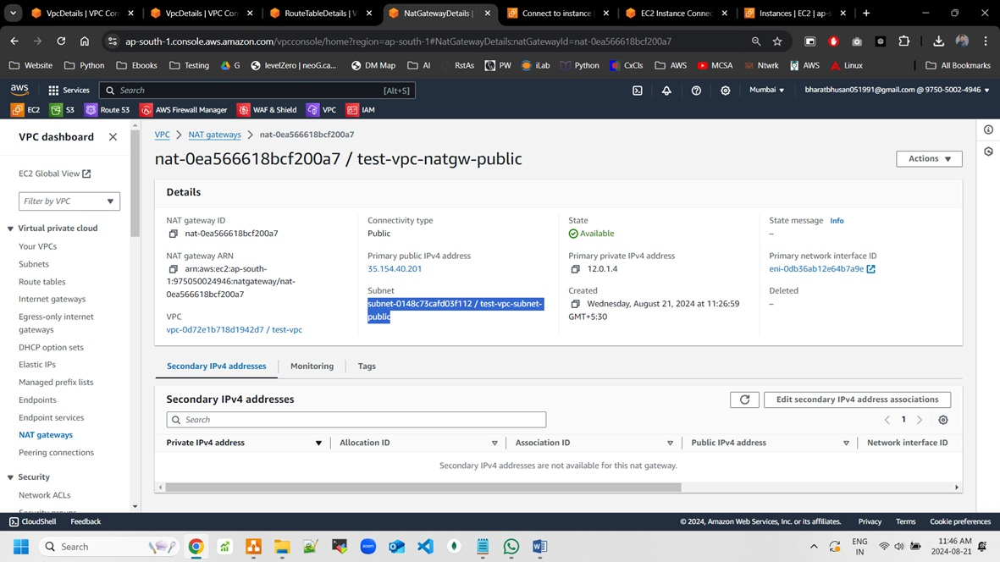
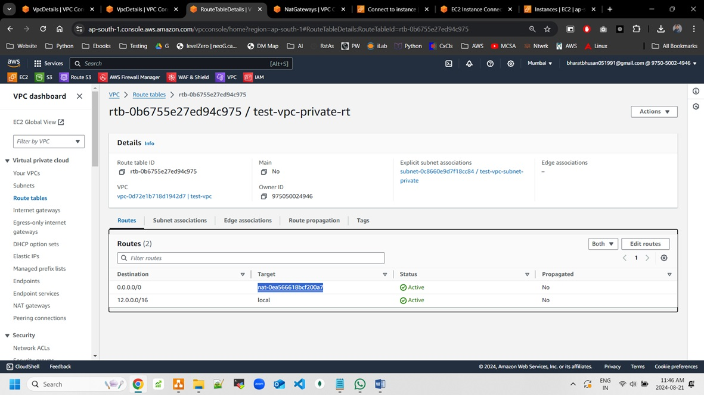

# NAT-Gateway-Setup-in-VPC

## Project Name:  
**NAT Gateway Setup in Your VPC**

## Problem Statement:  
To securely route traffic between private subnets and the internet, while controlling access to resources within the Virtual Private Cloud (VPC). The setup uses a NAT Gateway to allow instances in a private subnet to initiate outbound IPv4 traffic to the internet or other AWS services but prevents the internet from initiating a connection with those instances.

## Tools and Technologies Used:  
- **Cloud Provider:** AWS
- **Region:** ap-south-1 (Mumbai)
- **VPC:** Virtual Private Cloud (test-vpc)
- **Subnets:** Private and Public Subnets (test-vpc-public, test-vpc-private)
- **Networking Components:** NAT Gateway, Route Tables, Internet Gateway
- **Automation:** AWS CLI or AWS CloudFormation (optional for automation)

## Architectural Diagram Explanation:

The architectural setup includes the following:

1. **VPC Creation:**  
   The VPC is created in the Mumbai region (`ap-south-1`) with a CIDR block of `12.0.0.0/16`.
   
2. **Subnets:**  
   Two subnets are created within the VPC:
   - **Public Subnet** (`test-vpc-public`): A subnet in the `ap-south-1a` availability zone with internet access via an Internet Gateway.
   - **Private Subnet** (`test-vpc-private`): A subnet in the `ap-south-1a` availability zone without direct internet access.

3. **NAT Gateway:**  
   The NAT Gateway is placed in the public subnet and associated with an Elastic IP. It allows instances in the private subnet to initiate outbound traffic to the internet while keeping them isolated from inbound internet traffic.


5. **Routing:**  
   - The public subnet uses a route table with a route to the Internet Gateway.
   - The private subnet uses a route table with a route to the NAT Gateway for outbound internet traffic.


5. **Security Groups and NACLs:**  
   Security groups and Network Access Control Lists (NACLs) are configured to allow inbound and outbound traffic as needed.

## Steps Involved in Setup:

1. **Create VPC:**  
   Create a VPC named `test-vpc` with the CIDR block `12.0.0.0/16`.

2. **Create Subnets:**  
   - Create a public subnet (`test-vpc-public`) with a CIDR block in the availability zone `ap-south-1a`.
   - Create a private subnet (`test-vpc-private`) with a CIDR block in the same availability zone.
     


3. **Create Internet Gateway and Attach to VPC:**  
   - Create an Internet Gateway.
   - Attach the Internet Gateway to the `test-vpc`.

4. **Create NAT Gateway:**  
   - Create a NAT Gateway in the public subnet and associate it with an Elastic IP.
   - Update the route table of the private subnet to route traffic to the NAT Gateway.


5. **Configure Route Tables:**  
   - Public Subnet Route Table: Route traffic to the Internet Gateway.
   - Private Subnet Route Table: Route traffic to the NAT Gateway.



6. **Update Security Groups and NACLs:**  
   Configure security groups and NACLs to allow appropriate traffic between instances and the internet.

## Automation Code Snippet (Using AWS CLI):

```bash
# Create a VPC
aws ec2 create-vpc --cidr-block 12.0.0.0/16 --region ap-south-1

# Create a public subnet
aws ec2 create-subnet --vpc-id vpc-xxxxx --cidr-block 12.0.1.0/24 --availability-zone ap-south-1a


# Create a private subnet
aws ec2 create-subnet --vpc-id vpc-xxxxx --cidr-block 12.0.2.0/24 --availability-zone ap-south-1a

# Create an Internet Gateway and attach it to the VPC
aws ec2 create-internet-gateway
aws ec2 attach-internet-gateway --internet-gateway-id igw-xxxxx --vpc-id vpc-xxxxx

# Allocate an Elastic IP for the NAT Gateway
aws ec2 allocate-address --domain vpc

# Create a NAT Gateway in the public subnet
aws ec2 create-nat-gateway --subnet-id subnet-xxxxx --allocation-id eipalloc-xxxxx

# Modify the route table to add a route to the Internet Gateway (for public subnet)
aws ec2 create-route --route-table-id rtb-xxxxx --destination-cidr-block 0.0.0.0/0 --gateway-id igw-xxxxx

# Modify the route table to add a route to the NAT Gateway (for private subnet)
aws ec2 create-route --route-table-id rtb-xxxxx --destination-cidr-block 0.0.0.0/0 --nat-gateway-id nat-xxxxx
```

## References:  
- **AWS Documentation:**  
  [NAT Gateway Setup](https://docs.aws.amazon.com/vpc/latest/userguide/vpc-nat-gateway.html)
- **VPC Setup Tutorial:**  
  [AWS VPC Subnet Tutorial](https://aws.amazon.com/vpc)

---

This README provides clear guidelines for setting up a NAT Gateway in a VPC along with the necessary steps and automation code snippets to automate the setup.
